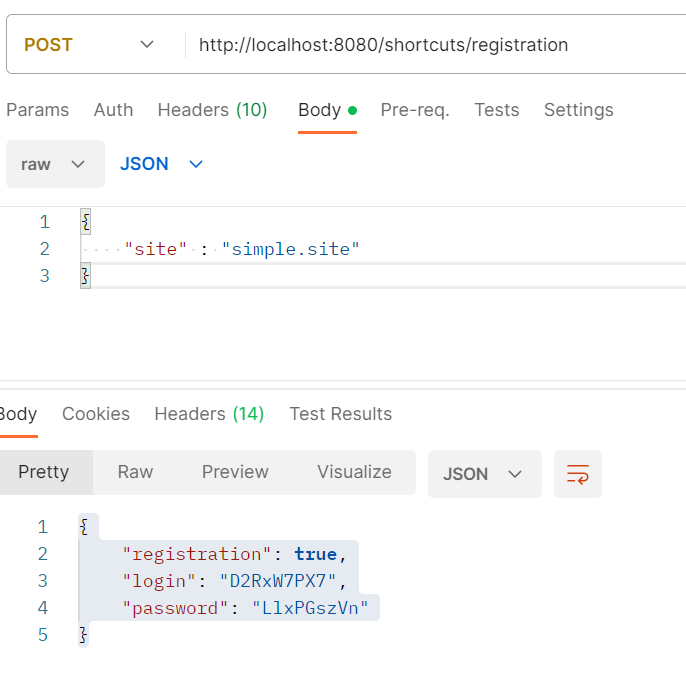
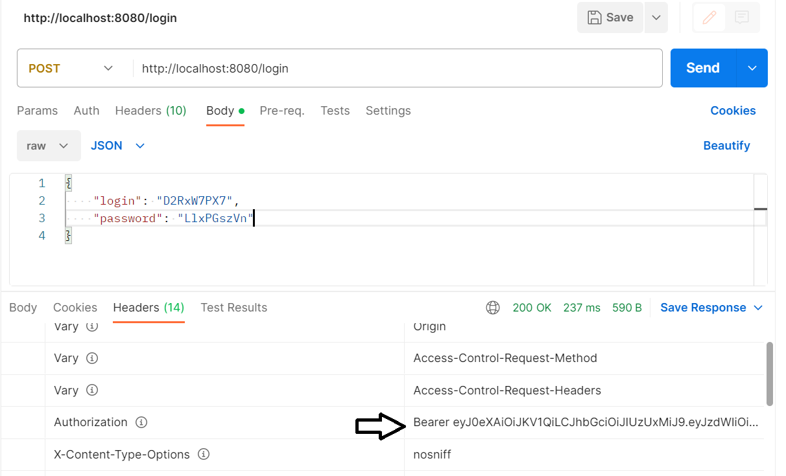
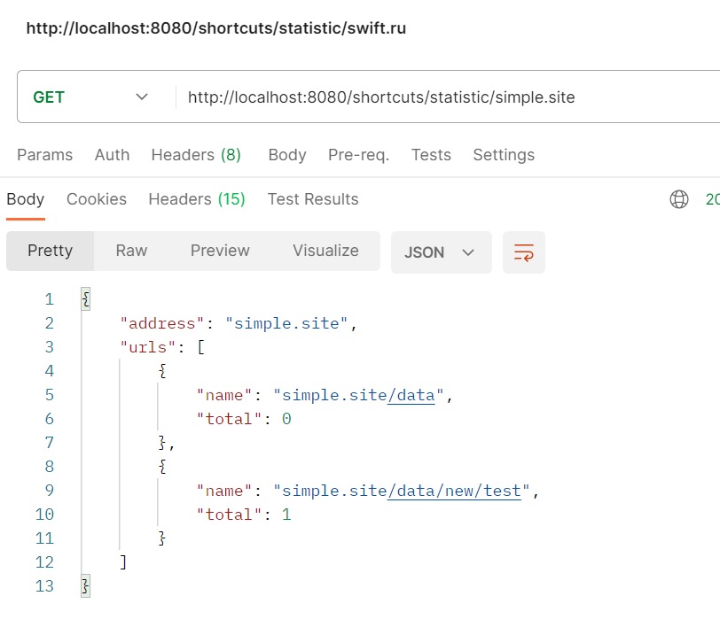
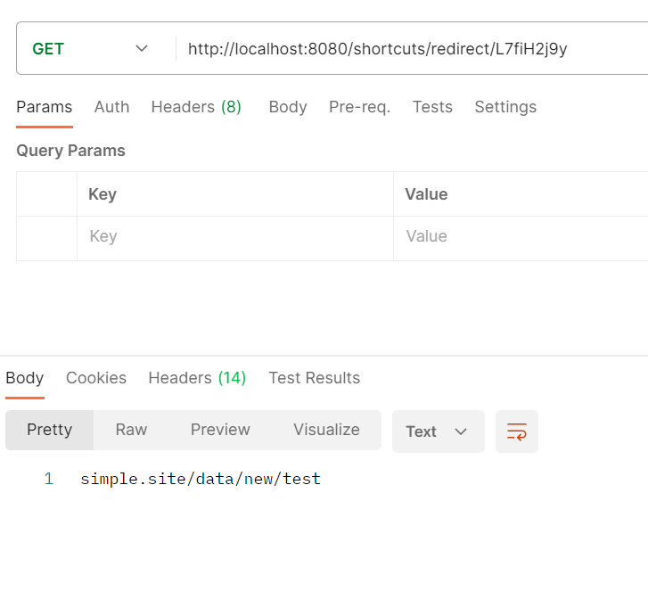

<h1>job4j_urlShortCut</h1>

Сервис укорачивания ссылок позволяет пользователям создавать короткие и удобные ссылки для своих длинных URL-адресов.
Каждому пользователю выдается уникальный ключ, который ассоциируется с введенным URL. Пользователи могут использовать этот ключ для получения преобразованных ссылок и использования их в своих проектах.

Используемые технологии в проекте:
- Spring boot 2.2.6 
- Spring Security 2.2.6
- Spring Web 2.2.6
- Spring Data JPA 2.2.6
- java-jwt 3.10.2
- hibernate-core 4.0.1
- lombok 1.18.26
- Liquibase 3.8.8

Необходимое окружение:
- Java 13
- Maven 3.8
- PostgreSQL 14

Для запуска приложения необходимо:

1. Создать базу данных с именем url_shortcut
```sql
    create database url_shortcut;
```

2. Собрать проект и запустить приложение Spring Boot
```
    mvn clean install
    mvn spring-boot:run
```


Основной функционал:

Регистрация пользователей.

### Для регистрации необходимо предоставить в теле запроса Url и получить сгенерированный логин/пароль:

```
    POST http://localhost:8080/shortcuts/registration
    {
    "site" : "simple.site"
    }
    
```



### Далее необходимо пройти авторизацию и получить JWT токен:

```
    POST http://localhost:8080/login
    {
    
    "login": "D2RxW7PX7",
    "password": "LlxPGszVn"
    
    }
```


### Теперь с помощью токена и отправкой URL можно получить уникальный код
```
    POST http://localhost:8080/shortcuts/convert 
    
    {
    
    "site": "simple.site",
    "url": "simple.site/data/new/test"
    
    }
```


### По GET запросу можно получить первоначальную ссылку

```
    GET http://localhost:8080/shortcuts/redirect/L7fiH2j9y
    
```


### С помощью запроса статистики можно получить список ссылок и количество вызовов redirect метода

```
    GET http://localhost:8080/shortcuts/statistic/simple.site
    
```


По всем вопросам по данному проекту вы можете написать мне на email kuptsovns@gmail.com